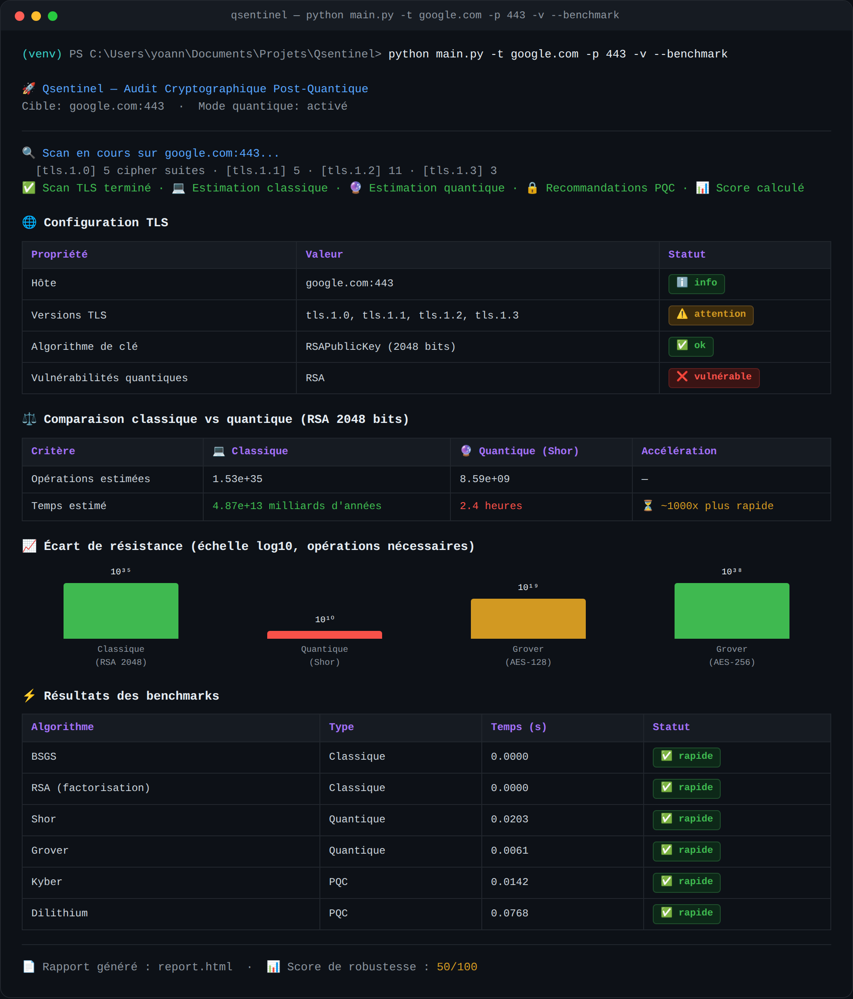
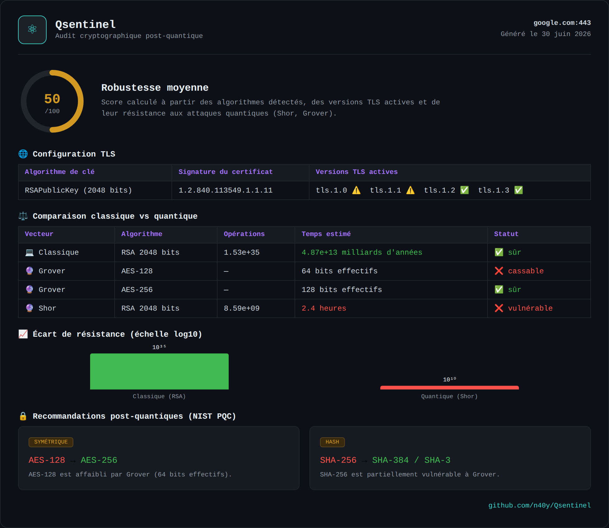

# Qsentinel


**Post-Quantum Cryptographic Audit Tool**

Qsentinel scans live TLS/SSH endpoints and tells you, in concrete numbers, how long it would actually take to break them — once with classical computing, once with a quantum computer running Shor's or Grover's algorithm.

## Why this tool exists

Most cryptographic audit tools tell you *what* algorithm a server uses (RSA-2048, AES-128, SHA-256...) and flag it as "weak" or "strong" based on static rules. That's useful, but it doesn't really answer the question that matters: **weak against what, and for how long?**

RSA-2048 is effectively unbreakable classically — the estimate is tens of trillions of years. The same key, attacked with a sufficiently large fault-tolerant quantum computer running Shor's algorithm, falls in a matter of hours. That gap — from "longer than the age of the universe" to "before lunch" — is the entire point of post-quantum cryptography, and it's very hard to internalize from a spec sheet.

Qsentinel exists to make that gap visible. It runs the real estimations (classical factorization complexity, Grover's quadratic speedup against symmetric ciphers, Shor's algorithm against RSA/ECC), benchmarks them, and produces a report that shows — side by side — what "secure" currently means and what it will stop meaning once quantum hardware catches up. The goal isn't to predict exactly when that happens; it's to show *why* migrating to post-quantum algorithms (Kyber, Dilithium, and the rest of the NIST PQC suite) isn't a theoretical precaution but a measurable, quantifiable necessity.

## What it does

- **Live TLS/SSH scanning** of a target host (`sslyze`, `paramiko`) — TLS versions, cipher suites, certificate key type and size.
- **Classical cracking time estimation** for the detected algorithms (RSA factorization via GNFS complexity, ECC via Pollard's rho / BSGS).
- **Quantum cracking time estimation** by simulating the relevant algorithms with Qiskit — Shor's algorithm against RSA/ECC, Grover's algorithm against symmetric keys and hashes.
- **Side-by-side comparison** of classical vs. quantum attack time, with the resulting speedup factor.
- **Post-quantum recommendations** mapped to NIST PQC standards (e.g. Kyber for key exchange, Dilithium for signatures).
- **Robustness score** (0–100) summarizing the target's overall posture against both classical and quantum threats.
- **Benchmark suite** measuring the actual runtime of each estimation/simulation routine (BSGS, RSA factorization, Shor, Grover, Kyber, Dilithium).
- **HTML report generation** with all of the above, ready to share or archive.

## Installation

It's strongly recommended to run Qsentinel inside a virtual environment, since it depends on `qiskit`, `liboqs`, `sslyze`, and `paramiko`.

<details>
<summary><b>Option A — using <code>venv</code> (standard library)</b></summary>

**Linux / macOS**

```bash
git clone https://github.com/n40y/Qsentinel.git
cd Qsentinel
python3 -m venv venv
source venv/bin/activate
pip install -r requirements.txt
```

**Windows (PowerShell)**

```powershell
git clone https://github.com/n40y/Qsentinel.git
cd Qsentinel
python -m venv venv
.\venv\Scripts\Activate.ps1
pip install -r requirements.txt
```

**Windows (cmd.exe)**

```cmd
git clone https://github.com/n40y/Qsentinel.git
cd Qsentinel
python -m venv venv
venv\Scripts\activate.bat
pip install -r requirements.txt
```

To leave the environment at any time: `deactivate`.

</details>

<details>
<summary><b>Option B — using <a href="https://docs.astral.sh/uv/">uv</a> (faster, recommended)</b></summary>

`uv` handles the virtual environment and dependency installation in one step, on Linux, macOS, and Windows alike.

```bash
git clone https://github.com/n40y/Qsentinel.git
cd Qsentinel
uv venv
```

Then activate it the same way as a standard `venv`:

```bash
# Linux / macOS
source .venv/bin/activate

# Windows PowerShell
.venv\Scripts\Activate.ps1
```

Install dependencies:

```bash
uv pip install -r requirements.txt
```

Or, without activating the environment at all, run commands directly through `uv`:

```bash
uv run main.py -t google.com -p 443 -v --benchmark
```

If you don't have `uv` installed yet:

```bash
# Linux / macOS
curl -LsSf https://astral.sh/uv/install.sh | sh

# Windows PowerShell
powershell -ExecutionPolicy ByPass -c "irm https://astral.sh/uv/install.ps1 | iex"
```

</details>

## Usage

```bash
python main.py -t <target> -p <port> -v --benchmark
```

| Option | Description |
|---|---|
| `-t, --target` | Target host to scan (e.g. `google.com`) |
| `-p, --port` | Target port (default: `443`) |
| `-v, --verbose` | Verbose output |
| `--benchmark` | Run and display the algorithm benchmark suite |

The scan produces a console summary and an HTML report (`report.html`) containing the TLS configuration, the classical/quantum comparison, the post-quantum recommendations, and the robustness score.

### Example: CLI run

<!-- IMAGE: CLI launch — replace with a screenshot of `python main.py -t <target> -p <port> -v --benchmark` running -->
<p align="center">
  
</p>

### Example: generated report

<!-- IMAGE: HTML report — replace with a screenshot of report.html -->
<p align="center">
  
</p>

## Tech stack

`Python` · `sslyze` · `paramiko` · `Qiskit` · `liboqs`

## Disclaimer

Qsentinel only performs passive TLS/SSH handshake analysis and offline cryptographic estimation — it does not attempt to break or interfere with any target's cryptography. Always make sure you are authorized to scan a given host before doing so.

## Author

[n40y](https://github.com/n40y)
